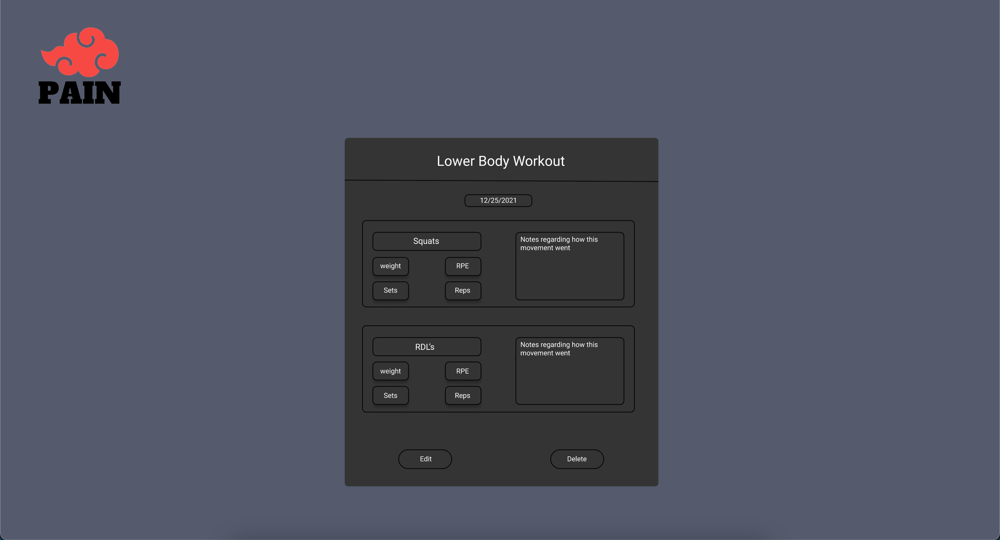
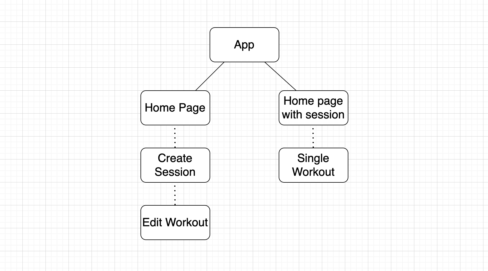

# Project Overview

## Project Name
[PAIN]()


## Project Description

PAIN is a effective, to the point workout app. In the age of millions of apps on the web, ranging from overcomplicated, to not useful at all. PAIN is a straight to the point kind of app. You are given the choice to start a session, you will then provide what workouts you did that session. You will include, but not limited to, the exercise name, the weight, the amount of reps and sets, the RPE, all of which are optional. Your sessions will be saved, so that you are able to edit, delete, or reflect later on the workouts you have completed. 

## [Wireframes](https://www.figma.com/file/2wN4bziabZIT0CI8t6DTJb/PAIN?node-id=16%3A142)




## [Component Hierarchy](https://drive.google.com/file/d/1Vq2jO9JwvXZcufjqjo9cXe9uhgFR4_FV/view?usp=sharing)



## API and Data Sample

```json
{
    "records": [
        {
            "id": "recnvVWaFprUD9PFV",
            "fields": {
                "rpe": "9",
                "reps": "1",
                "weight": "245",
                "session": "Upper Body",
                "sets": "2",
                "movement": "Bench Press"
            },
            "createdTime": "2021-12-01T18:50:50.000Z"
        },
        {
            "id": "rec61WVTa6Mf8zriA",
            "fields": {},
            "createdTime": "2021-12-01T18:50:50.000Z"
        },
        {
            "id": "recNJDXlY17QbGhrN",
            "fields": {},
            "createdTime": "2021-12-01T18:50:50.000Z"
        }
    ],
    "offset": "itrrkjNENEhXpK0jU/recNJDXlY17QbGhrN"
}
```

### MVP/PostMVP

#### MVP 

- Setup Airtable API
- Retrieve data from API
- Allow user to create a workout seesion 
- Send user session to API
- Display session on homepage
- Allow user to click on card and display data at a new route
- Allow user to edit/delete workout
- 

#### PostMVP  

- Incorporate user authentication
- Incorporate videos showing how to do workouts
- Allow for sharing workout videos

## Project Schedule

|  Day | Deliverable | Status
|---|---| ---|
|Dec 2| Project Approval / Setup API / Retrieve data | Incomplete
|Dec 3| Pseudocode / React  | Incomplete
|Dec 6| React / debugging | Incomplete
|Dec 7| CSS / bootsrap / MUI | Incomplete
|Dec 8| MVP | Incomplete
|Dec 9| Project Presentation | Incomplete

## Timeframes

| Component | Priority | Estimated Time | Time Invested | Actual Time |
| --- | :---: |  :---: | :---: | :---: |
| Setting up API | H | 3hrs|  |  |
| Pseudocode | M | 3hrs|  |  |
| Make get request | L | 1hr |  |  |
| Debugging | M | 4hrs|  |  |
| Create Workout Form | H | 2hrs|  |  |
| Make Post request | M | 4hrs|  |  |
| Debugging | H | 2hrs|  |  |
| Display info on Homepage | H | 4hrs|  |  |
| Make Route for Single workout | L | 1hr|  |  |
| Make Put request | M | 4hrs|  |  |
| Debugging | H | 2hrs|  |  |
| Make delete request | M | 2hrs|  |  |
| Debugging | H | 2hrs|  |  |
| CSS/BootStrap/MUI | H | 6hrs|  |  |
| Display info on Homepage | H | 3hrs|  |  |
| Total | H | 43hrs|  |  |

## SWOT Analysis

### Strengths:
Making axios calls to API

### Weaknesses:
Styling

### Opportunities:
Get better at using libraries

### Threats:
Creating nested data in API